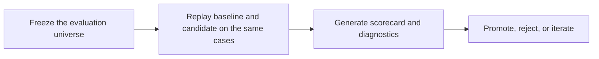

# policy-eval-harness

[](https://github.com/terracio/policy-eval-harness/actions/workflows/ci.yml)
[](LICENSE)
[](https://www.python.org/downloads/release/python-3100/)
[](docs/releases/v0.1.0.md)

A reference methodology for replay-driven failure analysis and promotion-gated policy iteration in sequential agentic systems.

**TL;DR:** This repo helps teams prove whether a new AI policy is actually better than the old one before shipping it.

**Business impact:** It replaces vibes-based AI iteration with deterministic replay, scorecards, and explicit promotion gates.

## At A Glance

Many teams can trace an agent run or grade a single output. Fewer teams can answer the harder question: if a policy makes decisions over time, should the new version replace the old one?

`policy-eval-harness` is a local-first reference implementation for that problem. In practice, it does four things:

- freezes the same evaluation cases for baseline and candidate
- replays both policies against that exact same ordered universe
- scores utility, behavior, and reliability on dev and holdout
- promotes or rejects the candidate using explicit gates



## Where This Matters

This approach is useful anywhere an AI system makes sequential decisions and you need proof, not intuition:

| Area | Example Policy | Why Replay Matters |
|---|---|---|
| Fraud and risk review | Approve, reject, or escalate a suspicious case | The new policy must face the exact same cases as the old one |
| Claims and underwriting | Accept, request more info, or route to manual review | Timing and escalation behavior affect downstream utility |
| Customer support ops | Answer now, wait, or escalate to a human | Averages hide whether the policy over-escalates or fails late |
| Compliance workflows | Clear, block, or send for secondary review | Promotion decisions need auditability, not prompt vibes |
| Agent routing systems | Continue autonomously or hand off to a specialist | The failure mode is often in the sequence, not one output |

## Why Not Just Use Regular Evals?

Most eval tooling is strongest for static outputs: prompt comparisons, rubric scoring, trace inspection, and CI checks.

This repo is narrower. It is for sequential policies where:

- behavior unfolds over multiple steps
- the candidate must be compared against the baseline on the same opportunities
- utility matters, not just output quality
- promotion should depend on explicit gates instead of qualitative preference

## What You Can Reproduce

The public repo currently lets you reproduce a full end-to-end methodology loop on a domain-neutral approval workflow:

- load a fixed public-safe evaluation universe from CSV
- replay three policy variants over the same ordered cases
- generate deterministic replay artifacts
- evaluate candidates against a shared baseline on dev and holdout
- inspect scorecards and promotion verdicts backed by explicit thresholds

The bundled example shows one candidate that should be promoted and one that should fail clearly.

It also includes two secondary methodology workflows:

- a label-comparison example showing how target construction can dominate out-of-sample signal quality
- a 2x2 ablation example showing how interaction effects can surface interference that aggregate wins hide

## Quickstart

```bash
python3.10 -m venv .venv
source .venv/bin/activate
python -m pip install --upgrade pip
python -m pip install -e .
policy-eval demo run --manifest examples/core_demo/demo.yaml --out-dir ./artifacts/core_demo
```

That command writes a deterministic artifact bundle under `./artifacts/core_demo`.

## Verification

The public contract verification script regenerates the checked-in demo and workflow examples, then compares normalized CSV, JSON, Markdown, and Parquet artifacts against the golden files:

```bash
python scripts/verify_public_contracts.py
```

CI runs that same verification alongside the unit test suite on Python 3.10.

## Expected Outputs

The main demo produces:

- `replay/_combined/episode_summary.csv`
- `replay/_combined/step_trace.parquet`
- `replay/_combined/run_metadata.json`
- per-variant replay bundles under `replay/<variant_id>/`
- `evaluate/comparison_panel.parquet`
- `evaluate/scorecard.csv`
- `evaluate/promotion_decisions.json`

The evaluation gate generates a deterministic holdout scorecard comparing each candidate against the shared baseline. The bundled synthetic approval demo looks like this:

| Policy Variant | Mean Utility | Delta vs Baseline | Pathology Rate | Error Case Rate | Verdict |
|---|---:|---:|---:|---:|---|
| `approval_baseline_v1` | `0.790` | `-` | `0.00` | `0.00` | `-` |
| `approval_targeted_v2` | `0.885` | `+0.095` | `0.00` | `0.00` | `PROMOTE` |
| `approval_overactive_v1` | `-0.150` | `-0.940` | `0.00` | `0.00` | `REJECT` |

That gives a reader the core idea immediately: same cases, explicit comparison, and a promotion decision backed by a scorecard.

## Public Command Surface

After installation, the current public commands are:

```bash
policy-eval demo run --manifest examples/core_demo/demo.yaml --out-dir ./artifacts/core_demo
policy-eval replay run --manifest path/to/replay.yaml --out-dir ./artifacts/replay
policy-eval evaluate run --manifest path/to/evaluate.yaml --out-dir ./artifacts/evaluate
policy-eval workflow label-compare run --manifest examples/label_compare/label_compare.yaml --out-dir ./artifacts/label_compare
policy-eval workflow ablation-2x2 run --manifest examples/ablation_2x2/ablation_2x2.yaml --out-dir ./artifacts/ablation_2x2
```

The main demo is still the primary entrypoint. `replay run` and `evaluate run` expose that core workflow in separate stages, while the two `workflow` commands package secondary methodology patterns.

## Repo Map

- `examples/core_demo/`: checked-in synthetic universe, manifests, and golden outputs
- `examples/label_compare/`: fixed tabular dataset, manifest, and golden outputs for label-scheme comparisons
- `examples/ablation_2x2/`: fixed comparison panel, manifest, and golden outputs for interaction analysis
- `src/policy_eval_harness/replay/`: deterministic replay runtime and public replay types
- `src/policy_eval_harness/evaluation/`: scorecards and promotion-gate evaluation
- `src/policy_eval_harness/demo/`: bundled approval-workflow demo executor and orchestrator
- `src/policy_eval_harness/workflows/`: secondary label-comparison and ablation workflow runners
- `docs/methodology.md`: problem framing, invariants, and limitations
- `docs/case_study.md`: walk-through of the approval-workflow demo
- `docs/design_principles.md`: design tradeoffs behind the repo
- `docs/publication_readiness.md`: final release-gate checklist and verdict for `v0.1.0`
- `docs/releases/v0.1.0.md`: scope note for the first public release

## Read More

- [Methodology](docs/methodology.md)
- [Case Study](docs/case_study.md)
- [Design Principles](docs/design_principles.md)
- [Publication Readiness](docs/publication_readiness.md)
- [v0.1.0 Release Note](docs/releases/v0.1.0.md)
