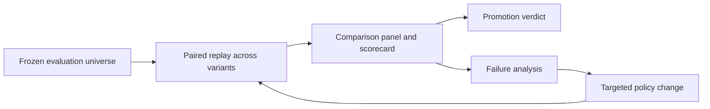

# policy-eval-harness

A reference methodology for replay-driven failure analysis and promotion-gated policy iteration in sequential agentic systems.

## Why This Exists

Many AI teams can trace agent runs, score outputs, and compare prompts. Fewer teams can answer a stricter question: should a new sequential policy be promoted when behavior unfolds over time, utility matters, and baseline and candidate must face the exact same opportunities?

`policy-eval-harness` is a local-first reference implementation for that workflow. It freezes a sequential evaluation universe, replays baseline and candidate policies against the same ordered cases, and turns the result into auditable promotion decisions.

## When To Use It

Use this approach when you are evaluating a policy that:

- acts over multiple time steps instead of one static input
- can wait, escalate, or terminate early
- needs paired comparison against a baseline on the same cases
- should be promoted only if explicit utility and reliability gates pass

This repo is not trying to replace tracing, rubric scoring, or general-purpose eval platforms. Those tools are useful. This repo is narrower: it focuses on decision-grade iteration for sequential policies where deterministic replay and paired promotion gates matter.

## What You Can Reproduce

The public repo currently lets you reproduce a full end-to-end methodology loop on a domain-neutral approval workflow:

- load a fixed public-safe evaluation universe from CSV
- replay three policy variants over the same ordered cases
- generate deterministic replay artifacts
- evaluate candidates against a shared baseline on dev and holdout
- inspect scorecards and promotion verdicts backed by explicit thresholds

The bundled example shows one candidate that should be promoted and one that should fail clearly.

It also includes two secondary methodology workflows:

- a label-comparison example showing how target construction can dominate out-of-sample signal quality
- a 2x2 ablation example showing how interaction effects can surface interference that aggregate wins hide

## Quickstart

```bash
python3.10 -m venv .venv
source .venv/bin/activate
python -m pip install --upgrade pip
python -m pip install -e .
policy-eval demo run --manifest examples/core_demo/demo.yaml --out-dir ./artifacts/core_demo
```

That command writes a deterministic artifact bundle under `./artifacts/core_demo`.

## Verification

The public contract verification script regenerates the checked-in demo and workflow examples, then compares normalized CSV, JSON, Markdown, and Parquet artifacts against the golden files:

```bash
python scripts/verify_public_contracts.py
```

CI runs that same verification alongside the unit test suite on Python 3.10.

## Expected Outputs

The main demo produces:

- `replay/_combined/episode_summary.csv`
- `replay/_combined/step_trace.parquet`
- `replay/_combined/run_metadata.json`
- per-variant replay bundles under `replay/<variant_id>/`
- `evaluate/comparison_panel.parquet`
- `evaluate/scorecard.csv`
- `evaluate/promotion_decisions.json`

At a high level, the workflow is:



## Public Command Surface

After installation, the current public commands are:

```bash
policy-eval demo run --manifest examples/core_demo/demo.yaml --out-dir ./artifacts/core_demo
policy-eval replay run --manifest path/to/replay.yaml --out-dir ./artifacts/replay
policy-eval evaluate run --manifest path/to/evaluate.yaml --out-dir ./artifacts/evaluate
policy-eval workflow label-compare run --manifest examples/label_compare/label_compare.yaml --out-dir ./artifacts/label_compare
policy-eval workflow ablation-2x2 run --manifest examples/ablation_2x2/ablation_2x2.yaml --out-dir ./artifacts/ablation_2x2
```

The main demo is still the primary entrypoint. `replay run` and `evaluate run` expose that core workflow in separate stages, while the two `workflow` commands package secondary methodology patterns.

## Repo Map

- `examples/core_demo/`: checked-in synthetic universe, manifests, and golden outputs
- `examples/label_compare/`: fixed tabular dataset, manifest, and golden outputs for label-scheme comparisons
- `examples/ablation_2x2/`: fixed comparison panel, manifest, and golden outputs for interaction analysis
- `src/policy_eval_harness/replay/`: deterministic replay runtime and public replay types
- `src/policy_eval_harness/evaluation/`: scorecards and promotion-gate evaluation
- `src/policy_eval_harness/demo/`: bundled approval-workflow demo executor and orchestrator
- `src/policy_eval_harness/workflows/`: secondary label-comparison and ablation workflow runners
- `docs/methodology.md`: problem framing, invariants, and limitations
- `docs/case_study.md`: walk-through of the approval-workflow demo
- `docs/design_principles.md`: design tradeoffs behind the repo
- `docs/publication_readiness.md`: final release-gate checklist and verdict for `v0.1.0`
- `docs/releases/v0.1.0.md`: scope note for the first public release

## Read More

- [Methodology](docs/methodology.md)
- [Case Study](docs/case_study.md)
- [Design Principles](docs/design_principles.md)
- [Publication Readiness](docs/publication_readiness.md)
- [v0.1.0 Release Note](docs/releases/v0.1.0.md)
