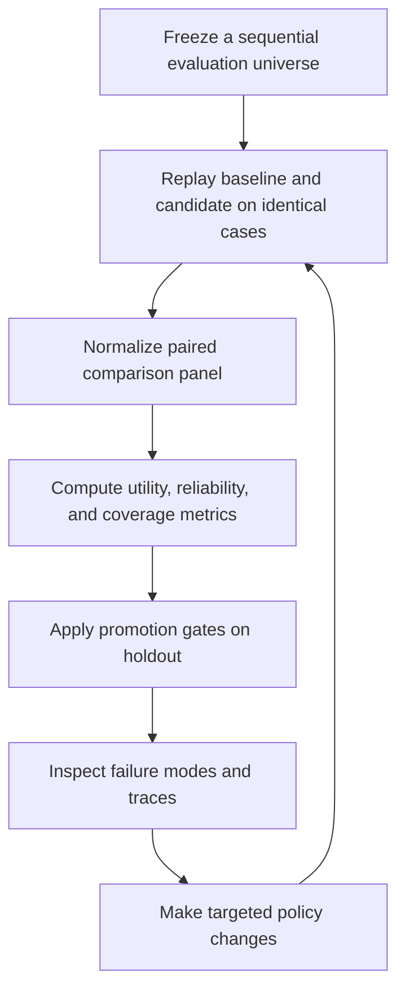

# Methodology

## Problem Class

This repo targets sequential, stateful, partially observable policy systems.

In these systems, a policy does not make one isolated prediction. It sees an evolving case, can wait for more evidence, can terminate early, and can change downstream utility by acting too soon, too late, or too often.

That makes ordinary offline eval patterns incomplete on their own. Prompt-quality scores and trace review can still be useful, but they do not guarantee a fair comparison when baseline and candidate encounter different opportunities or different execution timing.

## Core Loop

`policy-eval-harness` centers the evaluation loop around a frozen universe and auditable promotion rules.

## Design Invariants

### Fixed universe

Every compared variant must run on the same ordered case set. In the public repo, that universe is prebuilt and file-backed. Universe generation from raw source systems is intentionally out of scope for v1.

### Paired comparison

A candidate should be judged against a baseline on shared `case_id`s, not on different samples. That is why replay artifacts normalize around case-level pairing and why coverage diagnostics matter.

### Explicit baselines

Evaluation is comparative. A metric only becomes decision-grade when it is anchored to a baseline or explicit comparator.

### Promotion gates

A better-looking run is not enough. Promotion requires passing declared thresholds on the authoritative split, currently holdout by default.

### Inspectable artifacts

The workflow should leave behind step traces, summaries, scorecards, and verdict files that can be reviewed without access to hidden services.

## What Counts As A Valid Comparison

A valid comparison in this repo means:

- the baseline and candidate replay the same frozen universe
- the pairing key is preserved at the case level
- the evaluation split is explicit
- required metrics are available for the chosen gate profile
- missing coverage is reported instead of silently ignored

If those conditions do not hold, the right outcome is often `no_verdict`, not a forced pass/fail.

## Failure Analysis Loop

The point of replay is not only to produce one scorecard. It is to localize where behavior breaks.

Typical questions this method supports:

- Which case cohorts improved or regressed?
- Did the candidate act earlier, later, or more often?
- Did reliability hold while utility improved?
- Are failures concentrated in one decision pattern, such as premature escalation or over-waiting?

The public demo makes this concrete: a targeted policy improves utility by waiting less on easy cases while still escalating ambiguous ones, whereas an overactive policy acts too early and destroys holdout utility.

## Extensions

Two secondary workflow patterns sit next to the main replay/evaluate/promotion path:

- label comparison: testing whether target construction changes apparent signal quality more than model choice does
- 2x2 ablation analysis: measuring standalone component effects and interaction terms to detect interference

Those patterns are part of the broader methodology story, but they are extensions. The primary product surface of this repo is still deterministic replay plus promotion-gated evaluation.

## Non-Claims

This repo does not claim:

- a new foundational theory of evaluation
- universal off-policy evaluation guarantees
- a replacement for general-purpose tracing or eval platforms
- a production runtime for live agents

The contribution is applied methodology: a reproducible workflow for comparing sequential policies, surfacing failure points, and making promotion decisions with explicit gates.

## Current Public Scope

Today’s public repo includes:

- deterministic replay over prebuilt CSV or Parquet universes
- replay artifacts and evaluation artifacts
- a domain-neutral approval-workflow demo with checked-in golden outputs

It does not include:

- private domain data
- live integrations
- provider-specific prompts
- trained proprietary models
- raw-data universe construction pipelines
